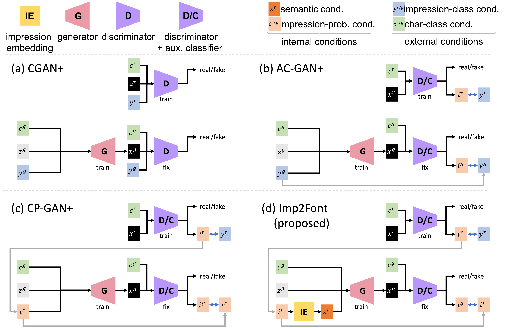

# Impressions2Font:Generating Fonts by Specifying Impressions(ICDAR2021)
This repository provides PyTorch implementation for [**Impressions2Font (Imp2Font)**](https://arxiv.org/abs/2103.10036).Given an *impression word*, Imp2Font can generate the appropriate style font image. Accepted as input are single *impression word*,  multiple *impression words* and *impression words* that can be represented by pre-trained word2vec.



**Note:**
In our other studies, we have also proposed font generation model from specific impression. Please check them from the links below.
- [**Font Generation with Missing Impression Labels**](https://takuhirok.github.io/rGAN/) (ICPR 2022): GAN for *impression words*
## Paper
**Generating Fonts by Specifying Impressions**.<br>
Seiya Matsuda, Akisato Kimura, and Seichi Uchida<br>
In ICDAR 2021 (Poster session).


[**[Paper]**](https://arxiv.org/abs/2103.10036)
[**[Slides]**](docs/ICDAR2021_matsuda_supplementary_material.pdf)
[**[Poster]**](docs/287_presentation.pdf)

## Abstract
 Various fonts give us various impressions, which are often
represented by words. This paper proposes Impressions2Font (Imp2Font)
that generates font images with specific impressions. Imp2Font is an extended version of conditional generative adversarial networks (GANs).
More precisely, Imp2Font accepts an arbitrary number of impression
words as the condition to generate the font images. These impression
words are converted into a soft-constraint vector by an impression embedding module built on a word embedding technique. Qualitative and
quantitative evaluations prove that Imp2Font generates font images with
higher quality than comparative methods by providing multiple impression words or even unlearned words.

## Installation

Clone this repo:

```bash
git clone https://github.com/SeiyaMatsuda/Impressions2Font.git
cd Impressions2Font/
```
First, install Python 3+. Then install [PyTorch](https://pytorch.org/) 1.0 and other dependencies by

```bash
pip install -r requirements.txt

```

## Datasets
Download the dataset from [Google Drive](https://drive.google.com/u/0/open?id=10GRqLu6-1JPXI8rcq23S4-4AhB6On-L6). Place in the following directory. 

```bash
dataset/
```

This dataset is constructed by Chen et al. [*large-scale Tag-based Font Retrieval with Generative Feature Learning*](https://arxiv.org/abs/1909.02072). ICCV 2019

## preprocessing dataset
Crop the glyph images appropriately and save it as npy format.
```bash
python preprocessing.py
```

## train

### Example
To train **Imp2Font** on **MyFonts Dataset**, run the following:

```bash
python main.py
```

## Test
To generate images, use the following script:

```bash
python test.py \
    --label impression words \
    --g_path trained_model_path \
    --out output_directory_path
```

Please choose one of the options in the square brackets ([ ]).

### Example
To generate a font from the impression word **elegant**, run the following:

```bash
python test.py \
    --label elegant
    --g_path outputs/img_iter_100000.pth \
    --out samples
```
### Example
To generate a font from the impression word **elegant** & **serif**, run the following:

```bash
python test.py \
    --label elegant serif
    --g_path outputs/img_iter_100000.pth \
    --out samples
```

## MyFonts Dataset
MyFonts Dataset contains 18,815 fonts and 1,824 impression words (or tags) from MyFonts.com. 
Impression words are given as multi-label.
The figure below shows a part of the sample and the corresponding impression words.


## Examples of generated images
### Impression words you can input
**single impression word.**
The original **ten** classes (0,...,9; defined in (a)) are divided into **five** classes (*A*,...,*E*) with class overlapping, as shown in (b).


**multiple impression word.**
Each column shows samples associated with the same class-distinct and class-mutual states: *airplane*, *automobile*, *bird*, *cat*, *deer*, *dog*, *frog*, *horse*, *ship*, and *truck*, respectively, from left to right. Each row includes samples generated from a fixed ***z****<sup>g</sup>* and a varied ***y****<sup>g</sup>*. CP-GAN (b) succeeds in selectively generating class-distinct (red font) and class-mutual (blue font) images, whereas AC-GAN (a) fails to do so.


## Citation
If you use this code for your research, please cite our paper.

```
@inproceedings{matsuda2021impressions2font,,
  title={Impressions2Font: Generating Fonts by Specifying Impressions},
  author={Matsuda, Seiya and Kimura, Akisato and Uchida, Seiichi},
  booktitle={ICDAR},
  year={2021}
}
